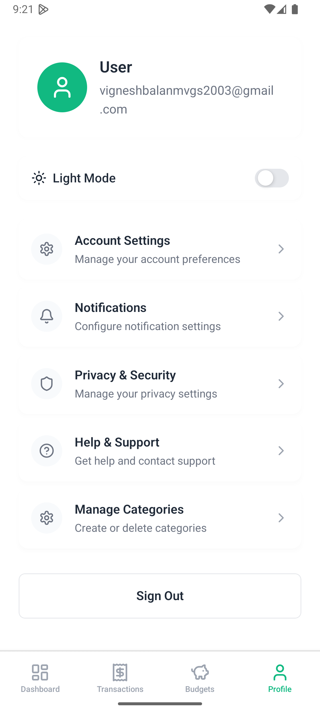

# FinanceApp 👋

This is a personal finance management application built with [Expo](https://expo.dev). It helps you track your income, expenses, and budgets to achieve your financial goals.

## Screenshots

Here are some screenshots of the application:

| Dashboard | Transactions | Budgets |
| :---: | :---: | :---: |
|  |  |  |

| Profile | Categories | Notifications |
| :---: | :---: | :---: |
|  |  |  |


## Features

- **Dashboard:** Get a quick overview of your financial status.
- **Transactions:** Add, edit, and view your income and expenses.
- **Budgets:** Set monthly budgets for different categories and track your spending.
- **Categories:** Customize your spending categories.
- **Login & Registration:** Securely create an account and log in to manage your financial data.
- **Cross-Platform:** Works on iOS, Android, and the web.

## Get started

1. Install dependencies

   ```bash
   npm install
   ```

2. Start the app

   ```bash
   npx expo start
   ```

In the output, you'll find options to open the app in a

- [development build](https://docs.expo.dev/develop/development-builds/introduction/)
- [Android emulator](https://docs.expo.dev/workflow/android-studio-emulator/)
- [iOS simulator](https://docs.expo.dev/workflow/ios-simulator/)
- [Expo Go](https://expo.dev/go), a limited sandbox for trying out app development with Expo

You can start developing by editing the files inside the **app** directory. This project uses [file-based routing](https://docs.expo.dev/router/introduction).

## Learn more

To learn more about developing your project with Expo, look at the following resources:

- [Expo documentation](https://docs.expo.dev/): Learn fundamentals, or go into advanced topics with our [guides](https://docs.expo.dev/guides).
- [Learn Expo tutorial](https://docs.expo.dev/tutorial/introduction/): Follow a step-by-step tutorial where you'll create a project that runs on Android, iOS, and the web.

## Join the community

Join our community of developers creating universal apps.

- [Expo on GitHub](https://github.com/expo/expo): View our open source platform and contribute.
- [Discord community](https://chat.expo.dev): Chat with Expo users and ask questions.